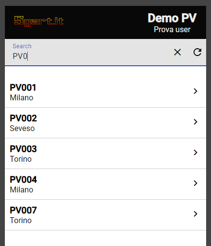
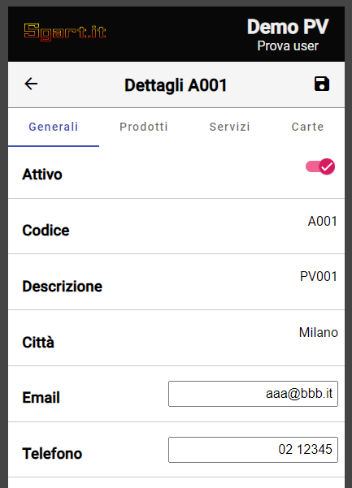
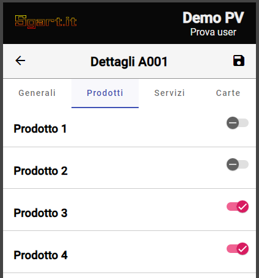

# SgartIt.Net.Angular.Esempio1

esempio in Angular 17 e .NET 8 

per creare il DB MS SQL Server: 

- /SgartIT.Net.Angular.Esempio1.Server/DB/10-schema.sql 
- /SgartIT.Net.Angular.Esempio1.Server/DB/10-schema.sql

impostare la connection string in: /appsettings.json

il sito risponde all'indirizzo:

- https://localhost:4200/ la UI
- https://localhost:7001/ le API

https://www.sgart.it/